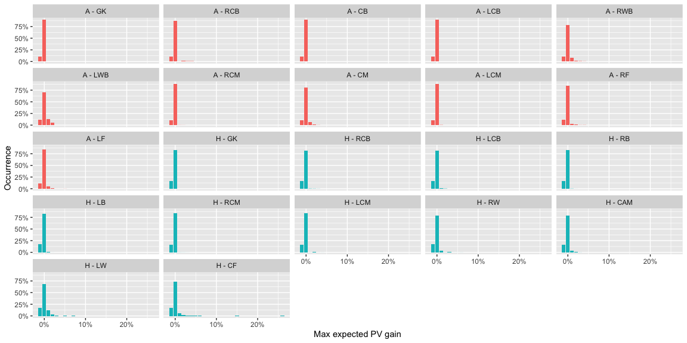

Using possession value to measure the value of the actions of players is
a commonly seen statistic on Twitter now. These are usually on ball
ations though. A question I’ve been thinking about is how can we value
off ball actions.

Using pitch control, we can estimate the probability of players
controlling the ball in various parts of the pitch so we could simulate
passes that didn’t actually happen to estimate how much value a player
*could* have added from passes they *could* have received. This is not
the same as estimating the value of their off ball actions but more like
an adjustment for the fact that not every player in the team will
receive as many passes, good opportunities to pass to them might get
missed because of reasons beyond their control, etc.

This is a thinking out loud kind of post. If you have ideas or inputs on
this then let’s talk. I’m on Twitter as @thecomeonman, or email mail dot
thecomeonman at gmail.

## Methodology

### Pitch Control

Pitch control tells you the probability of a team and its players
controlling the ball at various parts of the pitch if the ball were to
be passed there. This is done for each instant of the game and changes
based on the psitions of the players and their movement.

### Possession Value

The probability of scoring at the end of a play / in the next some moves
/ in the next some seconds once the team has a ball in a particular part
of the pitch.

I’ve used the PV grid at
<https://raw.githubusercontent.com/Friends-of-Tracking-Data-FoTD/LaurieOnTracking/master/EPV_grid.csv>
which looks like this for the team attacking left to right -

We can rotate the pitch 180 degrees and get the PV values for the
respective part of the pitch for the opposition for them attacking right
to left.

Note how the probability sharply climbs close to 50% near the opposition
goal but is quite low for most of the pitch.

### Combining Pitch Control and Possession Value

You should be able to combine these to evaluate what passing options
offer progress to the team in possession.

-   The team in possession already has a certain PV depending on where
    they have the ball: `AttackingOriginPV`
-   The defending team is equally at risk of conceding a goal from that
    position, so the `DefendingingOriginPV = -AttackingOriginPV`
-   Assuming it is possible to pass to every point on the pitch,
    `(x,y)`, the PV for each target location can be calculated for both
    the teams, `AttackingTargetPV_xy` and `DefendingTargetPV_xy`
-   At every point on the pitch, `(x,y)`, the attacking team has a
    probability of keeping control of the ball,
    `AttackingTeamProbabilty_xy`, and therefore the defending team’s
    probability is
    `DefendingTeamProbabilty_xy = 1 - AttackingTeamProbabilty_xy`
-   At every point, `(x,y)`, we can estimate an expected PV for playing
    a pass there:
    -   For the attacking team,
        `ExpectedAttackingTargetPV = ( AttackingTeamProbabilty_xy * AttackingTargetPV_xy ) - ( DefendingTeamProbabilty_xy * DefendingTargetPV_xy )`
    -   For the defending team, which is the same as the above formula
        with the attacking / defending terms exchanged,
        `ExpectedDefendingTargetPV = ( DefendingTeamProbabilty_xy * DefendingTargetPV_xy ) - ( AttackingTeamProbabilty_xy * AttackingTargetPV_xy )`
-   The change in PV from the current position can be calculated as the
    difference of the above terms from the PV of the starting position:
    -   For the attacking team,
        `ExpectedAttackingDeltaPV_xy = ExpectedAttackingTargetPV_xy - AttackingOriginPV`
    -   For the defending team,
        `ExpectedDefendingDeltaPV_xy = ExpectedDefendingTargetPV_xy - DefendingOriginPV`

Given we know the PV of each part of the pitch for both teams, and we
know that the probability of controlling the ball for both teams must
add up to 1 in each part of the pitch, we can calculate the minimum
value `ExpectedAttackingTargetPV_xy` must be in each part of the pitch
for it to compensate for `ExpectedDefendingDeltaPV_xy`, and therefore we
can also calculate the minimum value `AttackingTeamProbabilty_xy` should
be for `ExpectedAttackingTargetPV_xy` to attain the necessary value.
Think of this value for `AttackingTeamProbabilty_xy` as a kind of
breakeven probability. This is what those probabilities look like -

Note how the breakeven probabilities are very low close to the
opposition goal, because in that area the PV is very high for the
attacking team compared to the PV for the defending team. In fact right
at the goal mouth, the breakeven probability is 0.0146577. This part of
the pitch is a little hard to work with though because goalkeepers are
also modelled as outfield players in this pitch control model whereas in
reality they would actually exert far greater control than the model
gives them credit for because they can use their hands, grab the ball in
the air, dive, etc. which the other players cannot do. The pitch control
models don’t model shots either, it models passes, so the idea of
‘passing to the goal’ is aso a little odd. We will see later that this
situation occurs in very few frames though so for now we will pretend
this isn’t a problem and carry on.

I also ignore the possibility of passes that travel more than 2/3 the
length of the pitch. Only Ederson can make such passes. We consider the
area that is within a radius of 2/3 length of the pitch at any point of
time and ignore everything outside of it.

We can expect `ExpectedDefendingDeltaPV_xy` to be positive very often,
since `DefendingOriginPV` is a negative value so the more interesting
thing to analyse would be `ExpectedAttackingDeltaPV_xy`. A positive
`ExpectedAttackingDeltaPV_xy` implies that passing the ball to that
point on the pitch is likely to increase the chance of scoring even
after considering the risk of conceding the ball.

## Illustration

I chose this example because it also highlights the problem I mentioned
above while hopefully also giving you an idea of the concept.

Here is what the pitch control looks like in one of the frames. In my
calculations I exclude players that are offside so the two players from
the blue team in the offside position have zero contribution to pitch
control.

When you overlay the possession value and do all those calculations
listed above, this is what the pitch looks like in terms of
`ExpectedAttackingDeltaPV_xy`.

There is some territory in the middle of the pitch where passing the
ball is expected to return a positive `ExpectedAttackingDeltaPV_xy`. And
then there is the tricky area near the opposition goal, which has a
larger `ExpectedAttackingDeltaPV_xy` than the middle of the pitch. As a
result of this problem, the logic above would suggest that in this
situation the optimal action for the team in possession, the blue team,
should be to pass the ball all the way to the goal.

## Observations

I’ll use game 1 from Metrica Sports release available here -
<https://github.com/metrica-sports/sample-data/tree/master/data/Sample_Game_1>
to show some uses for this approach.

### Team level

Let us look at the proportion of the pitch that offers a net gain in
expected PV for the attacking team. This is simply checking how much of
the area of the pitch offers a positive `ExpectedAttackingDeltaPV_xy` at
each instant the team had possession of the ball.

-   Most of the time there is a very small part of the pitch, if at all,
    that offers a positive net expected delta PV for the attacking team.
-   30% to 40% of the time there is less than 1% of the pitch which
    offers a positive `ExpectedAttackingDeltaPV_xy` for both the teams.
    It is exactly 0 in 14% when the home team has the ball and 9% when
    the away team has the ball. A value of 0% means the team in
    possession of the ball has no options on the pitch to pass to where
    they are expected to increase their chances of scoring by enough to
    negate the chance of conceding and have to pass it to lower
    possession value part of the pitch. This is very important because a
    number of times a pass is played to retain possession and not
    necessarily increase the chance of scoring and the typical way PV is
    applied would give these passes a negative score which is unfair. We
    will see how we can right this injustice later in the post.
-   There is almost never a situation where more than 15% of the area of
    the pitch offers a positive `ExpectedAttackingDeltaPV_xy` for the
    attacking team.
-   The away team usually has options over a bigger area of the pitch
    than the home team.

Let us look at the values of the `ExpectedAttackingDeltaPV_xy` itself.

If the team were to randomly pass to any point on the pitch, at each
instant of the game, what delta PV could they expect?

-   From the earlier histogram, we saw most of the pitch is usually
    negative expected delta PV so it isn’t surprising that this
    distribution is completely in the negative. What this means is that
    a random pass is more likely to help the defending team than an
    attacking team.

Let us instead focus on the maximum expected delta PV gain at any
instant as that is indicative of the best option to pass for the
attacking team.

The proportion of time between -1 and 2% is:

    ## <table>
    ##  <thead>
    ##   <tr>
    ##    <th style="text-align:left;"> Team </th>
    ##    <th style="text-align:left;"> HighTeamMaxDeltaPVActual_pct </th>
    ##   </tr>
    ##  </thead>
    ## <tbody>
    ##   <tr>
    ##    <td style="text-align:left;"> A </td>
    ##    <td style="text-align:left;"> 94% </td>
    ##   </tr>
    ##   <tr>
    ##    <td style="text-align:left;"> H </td>
    ##    <td style="text-align:left;"> 94% </td>
    ##   </tr>
    ## </tbody>
    ## </table>

This means most of the time the optimal action available to the
attacking team has very low values of `ExpectedAttackingDeltaPV_xy`, if
at all. The proportion of time between -1% and 2% is -

<table>
<thead>
<tr>
<th style="text-align:left;">
Team
</th>
<th style="text-align:left;">
LowTeamMaxDeltaPVActual\_pct
</th>
</tr>
</thead>
<tbody>
<tr>
<td style="text-align:left;">
A
</td>
<td style="text-align:left;">
94%
</td>
</tr>
<tr>
<td style="text-align:left;">
H
</td>
<td style="text-align:left;">
94%
</td>
</tr>
</tbody>
</table>

### Team - Time level trends

-   Most of the high value expected delta PV for the attacking team, for
    either of the teams, is concentrated in time, which means they are
    just multiple frames from a much fewer number of instances. This
    means that for the most part the teams operate in a very low
    expected reward sort of situation and it is rare for a team to get a
    good opportunity to significantly progress the ball.
-   You can see some patterns across the game, for instance the home
    team had a couple of very good chances to progress the ball towards
    the start of the game and had other chances through the game as
    well, while the away team had many good chances to progress the ball
    towards the end of the game but not much during the earlier part of
    the game.

### Team - Space level trends

The location of the highest expected delta PV at each instant during the
sample of frames looks like as below.

-   The home team creates a lot more opportunities to progress the ball
    through the central areas in their own half compared to the away
    team that relies more heavily on opportunities wider areas. Wider
    areas are usually much more popular as a target though.
-   If you look at the area in the defensive halves, note how the away
    team more often presents the best opportunity towards the left,
    whereas the home team has better options more often on the right
    side deeper in their own half, and more often on the left side more
    advanced in their own half.
-   Both team have a preference towards the left side of the pitch in
    the final third.

### Instances of high positive expected delta PV

Let’s see what sort of potential passes show up if we filter for the
maximum `ExpectedAttackingDeltaPV_xy` value at any frame &gt;
TeamDeltaPVThreshold. Again, these are potential passes that *could*
have been played and not necessarily the actual pass that was played at
the time. There may also have been more than one such pass at any frame
but we will pick only the one with the maximum
`ExpectedAttackingDeltaPV_xy` value. It’s also likely that during the
course of the play, a similar kind of pass continued to remain the
optimal choice and you would therefore see it multiple times. We can
figure out a way to isolate unique passes and I can keep track of other
high value passes even if they aren’t the optimal but for now this is
all we have.

-   Lots of diagonal balls from deep in the defensive half to the wings.
-   Lots of good opportunities to cross from the deep left for the away
    team.
-   The home team has opportunities from all sorts of places to put the
    ball in the box.
-   The away team has quite a few of these high
    `ExpectedAttackingDeltaPV_xy` passes targeted towards the centre of
    the box whereas the home team has them spread all over the box.

## Adjusting for passing ability

A lot of the high positive expected delta PV passes are quite long
passes, and long passes are likely to fetch more PV because it usually
gets you much closer to the goal from where you were before. But it is
also much harder to execute such passes. A player may want to aim for
the most optimal target location but could end up playing the pass to an
area near the the target. What we saw above accounts for intention, but
we also need to account for exectuion to evaluate a more realistic
`ExpectedAttackingDeltaPV_xy`.

To incorporate that, I add some noise to the pass end location as a
function of the length of the pass. What this noise basically does is
that it assumes that a pass targeted at a particular location x,y could
go anywhere in the neighbourhood of x,y depending on how far x,y is from
the pass origin location. The longer the pass, the more the magnitude of
the noise. The noise is spread as a two dimensional gaussian around the
target location being aimed at. This definitely needs more rigorous
work, in terms of understanding the distribution of how a pass can be
off target but this is a reasonable simple assumption to get started
with to illustrate the concept at least.

The `ExpectedAttackingDeltaPV_xy` value now needs to be updated with the
pitch control and the possession value of the neighbouring areas and the
probability of the pass going to those neighbouring areas.

Once do that, here is how the numbers change. Not significantly, but
slightly. I’m calling this set of numbers the actual numbers and the
earlier set of numbers the ideal numbers.

-   The distributions don’t move significantly but they do move a little
    bit towards the direction of lower possible gains. This makes sense,
    you’d expect ådding noise to reduce the optimal value.
-   Note the slightly lesser instances of the model suggesting that the
    pass should be right at the goal mouth or even at the edge of the
    pitch on the wings. Because in those cases, there is a chance of the
    ball going out of bounds as well which would mean handing over the
    ball to the other team. This reduces how attractive those locations
    are and the optimal locations move a little inwards. How much they
    move inside is likely an artifact of the way the noise has been
    incorporated in the model though, because the locations are still
    clumped tightly

### Player level - Recipient

We calculated `ExpectedAttackingDeltaPV_xy` and
`ExpectedDefendingDeltaPV_xy` at a team level above. We can now
distribute that amongst the players of the attacking and defending team
respectively in proportion to their pitch control probability at that
part of the pitch:

-   `PlayerExpectedAttackingDeltaPV_xy = ExpectedAttackingDeltaPV_xy * PlayerPitchControlProbability_xy / AttackingTeamPitchControlProbability_xy`
-   `PlayerExpectedDefendingDeltaPV_xy = ExpectedDefendingDeltaPV_xy * PlayerPitchControlProbability_xy / DefendingTeamPitchControlProbability_xy`

The max of these values across the entire space of the pitch at each
instant during the game tells us what is the best option an individual
player offers. Various aggregations of these values over the game could
give us an indication of the contribution of a player.

We will use the actual version of the numbers and not the ideal version
of the numbers.

The percent of time players offer a high ( &gt; 0.01 )
`PlayerExpectedAttackingDeltaPV_xy` value:

<table>
<thead>
<tr>
<th style="text-align:left;">
Player
</th>
<th style="text-align:left;">
HighPlayerMaxDeltaPVActual\_pct
</th>
</tr>
</thead>
<tbody>
<tr>
<td style="text-align:left;">
A - CM
</td>
<td style="text-align:left;">
9%
</td>
</tr>
<tr>
<td style="text-align:left;">
H - CF
</td>
<td style="text-align:left;">
9%
</td>
</tr>
<tr>
<td style="text-align:left;">
H - CAM
</td>
<td style="text-align:left;">
5%
</td>
</tr>
<tr>
<td style="text-align:left;">
A - LF
</td>
<td style="text-align:left;">
5%
</td>
</tr>
<tr>
<td style="text-align:left;">
H - RW
</td>
<td style="text-align:left;">
5%
</td>
</tr>
<tr>
<td style="text-align:left;">
A - RF
</td>
<td style="text-align:left;">
4%
</td>
</tr>
<tr>
<td style="text-align:left;">
A - RCB
</td>
<td style="text-align:left;">
2%
</td>
</tr>
<tr>
<td style="text-align:left;">
A - LWB
</td>
<td style="text-align:left;">
18%
</td>
</tr>
<tr>
<td style="text-align:left;">
H - LW
</td>
<td style="text-align:left;">
15%
</td>
</tr>
<tr>
<td style="text-align:left;">
A - RWB
</td>
<td style="text-align:left;">
11%
</td>
</tr>
<tr>
<td style="text-align:left;">
H - RCB
</td>
<td style="text-align:left;">
1%
</td>
</tr>
<tr>
<td style="text-align:left;">
H - LCB
</td>
<td style="text-align:left;">
1%
</td>
</tr>
<tr>
<td style="text-align:left;">
H - LCM
</td>
<td style="text-align:left;">
1%
</td>
</tr>
<tr>
<td style="text-align:left;">
H - GK
</td>
<td style="text-align:left;">
0%
</td>
</tr>
<tr>
<td style="text-align:left;">
H - RCM
</td>
<td style="text-align:left;">
0%
</td>
</tr>
<tr>
<td style="text-align:left;">
A - CB
</td>
<td style="text-align:left;">
0%
</td>
</tr>
<tr>
<td style="text-align:left;">
A - RCM
</td>
<td style="text-align:left;">
0%
</td>
</tr>
<tr>
<td style="text-align:left;">
A - LCB
</td>
<td style="text-align:left;">
0%
</td>
</tr>
<tr>
<td style="text-align:left;">
A - LCM
</td>
<td style="text-align:left;">
0%
</td>
</tr>
<tr>
<td style="text-align:left;">
A - GK
</td>
<td style="text-align:left;">
0%
</td>
</tr>
<tr>
<td style="text-align:left;">
H - LB
</td>
<td style="text-align:left;">
0%
</td>
</tr>
<tr>
<td style="text-align:left;">
H - RB
</td>
<td style="text-align:left;">
0%
</td>
</tr>
</tbody>
</table>

-   Again, almost all of it lies between -1% to 1%.

-   The away team is a little better than the home team though, with a
    higher proportion of occurrence in the 0% to 1% band and less in the
    -1% to 0% compared to the home team.

-   The occurrence of high values is very low, which we could already
    have guessed from the team level distributions.

The locations of high progression opportunities,
`PlayerExpectedAttackingDeltaPV_xy` &gt; 0.01, are as below -

### Player level - Passer

Usually the passer is credited with the PV gained from a pass so we
should also look at what opportunities the rest of the team presents to
them, including the player in possession themselves.

<table>
<thead>
<tr>
<th style="text-align:left;">
Player
</th>
<th style="text-align:left;">
HighPlayerMaxDeltaPVActual\_pct
</th>
</tr>
</thead>
<tbody>
<tr>
<td style="text-align:left;">
A - CM
</td>
<td style="text-align:left;">
9%
</td>
</tr>
<tr>
<td style="text-align:left;">
H - RB
</td>
<td style="text-align:left;">
9%
</td>
</tr>
<tr>
<td style="text-align:left;">
A - CB
</td>
<td style="text-align:left;">
8%
</td>
</tr>
<tr>
<td style="text-align:left;">
A - LWB
</td>
<td style="text-align:left;">
8%
</td>
</tr>
<tr>
<td style="text-align:left;">
H - LB
</td>
<td style="text-align:left;">
8%
</td>
</tr>
<tr>
<td style="text-align:left;">
H - RW
</td>
<td style="text-align:left;">
8%
</td>
</tr>
<tr>
<td style="text-align:left;">
H - LCM
</td>
<td style="text-align:left;">
7%
</td>
</tr>
<tr>
<td style="text-align:left;">
A - RCB
</td>
<td style="text-align:left;">
6%
</td>
</tr>
<tr>
<td style="text-align:left;">
H - LCB
</td>
<td style="text-align:left;">
5%
</td>
</tr>
<tr>
<td style="text-align:left;">
H - RCM
</td>
<td style="text-align:left;">
4%
</td>
</tr>
<tr>
<td style="text-align:left;">
A - LF
</td>
<td style="text-align:left;">
30%
</td>
</tr>
<tr>
<td style="text-align:left;">
H - RCB
</td>
<td style="text-align:left;">
3%
</td>
</tr>
<tr>
<td style="text-align:left;">
H - CAM
</td>
<td style="text-align:left;">
19%
</td>
</tr>
<tr>
<td style="text-align:left;">
A - RWB
</td>
<td style="text-align:left;">
17%
</td>
</tr>
<tr>
<td style="text-align:left;">
H - CF
</td>
<td style="text-align:left;">
12%
</td>
</tr>
<tr>
<td style="text-align:left;">
A - RCM
</td>
<td style="text-align:left;">
11%
</td>
</tr>
<tr>
<td style="text-align:left;">
A - LCM
</td>
<td style="text-align:left;">
11%
</td>
</tr>
<tr>
<td style="text-align:left;">
A - LCB
</td>
<td style="text-align:left;">
10%
</td>
</tr>
<tr>
<td style="text-align:left;">
H - LW
</td>
<td style="text-align:left;">
10%
</td>
</tr>
<tr>
<td style="text-align:left;">
A - RF
</td>
<td style="text-align:left;">
0%
</td>
</tr>
</tbody>
</table>

### Using Player Level Metrics To Evalaute Player Performance

At each stretch of possession for a player, they have multiple
opportunities to play a pass. Using the metric of expected delta PV, we
can evaluate what kind of choices they had during that stretch of
possession and compare it to the choice they finally made and how sub
optimal that choice was. Players who have an eye for good passes should
make choices close to optimal very often. Have to add this bit of code.
