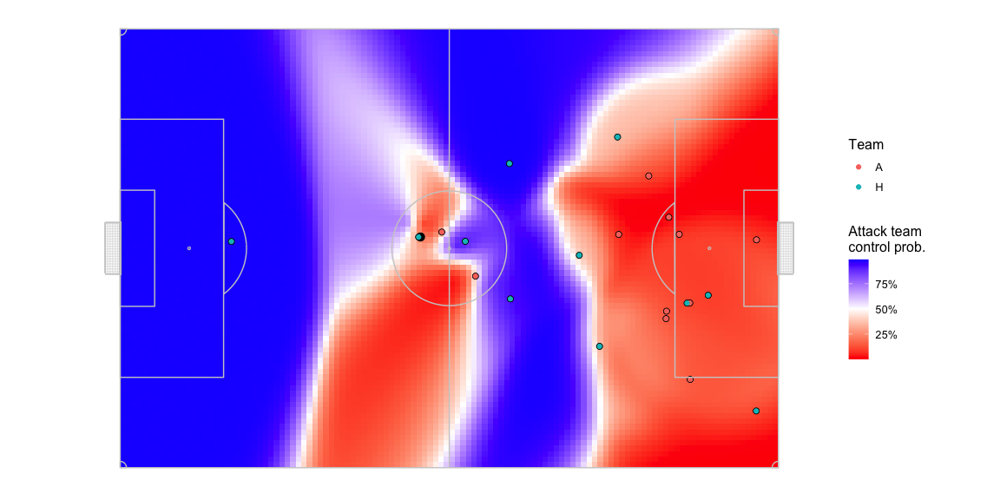
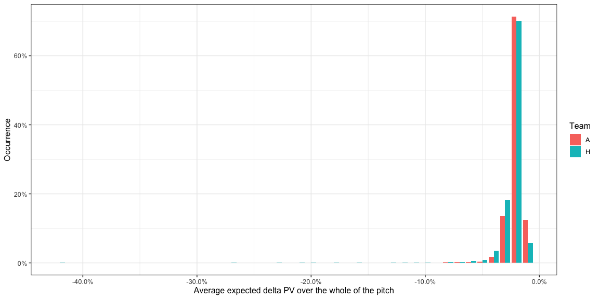
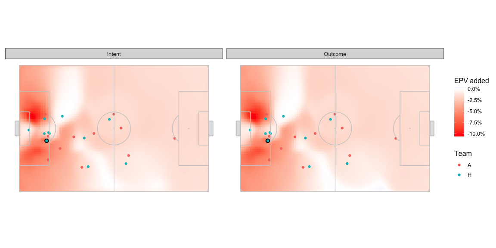
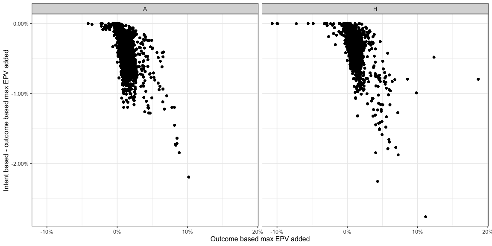

# Intent vs. Outcome: adding another layer to expected possession value

This is a thinking out loud kind of post. A bunch of basic charts and
numbers are here which should be enough to give an idea of what I’m
proposing. I want to think about this some more, which is usually a long
and slow process because life gets in the way, before doing a version
with nice looking vizes, etc. + also get feedback and comments from you
guys.

## Introduction

<http://www.lukebornn.com/papers/fernandez_sloan_2019.pdf> comes up with
a probabilistic possession value based on combining the possession value
( PV ) of the part of the pitch from a PV model, the probability of the
ball being controlled in the part of the pitch from a pitch control
model, and the probability of the ball being played to that part of the
pitch from an action likelihood model. These numbers can then be used to
infer passing tendencies, awareness, positioning, and many other things.

Pitch control and action likelihood are *outcome* based models. Pitch
control tells you the probability of controlling the ball if it were
played to that part of the pitch. Action likelihood is also probably
based on data from what *happened* in actual matches. An additional
aspect we need to evaluate things like player decision making is
*intent*. That’s what the rest of the post is about.

We’ll exclude action likelihood and only look at the output just from
the possession value and the pitch control models. This lets us evaluate
any opportunity across the pitch without prejudice for what players tend
to do in that situation.

If you’re familiar with pitch control and possession value, you can
probably just glance at the Glossary section and then skip straight to
the Intent vs. Outcome section.

## Methodology

### Pitch Control

Pitch control tells you the probability of a team and its players
controlling the ball at various parts of the pitch if the ball were to
be passed there. This is done for each instant of the game and changes
based on the positions of the players and their movement.

I use Spearman’s model but you could probably swap it out for any other
model too.

### Possession Value

The probability of scoring at the end of a play / in the next some moves
/ in the next some seconds once the team has a ball in a particular part
of the pitch.

I’ve used the PV grid at
<https://raw.githubusercontent.com/Friends-of-Tracking-Data-FoTD/LaurieOnTracking/master/EPV_grid.csv>
which looks like this for a team attacking left to right -

The possession value sharply climbs close to 50% near the opposition
goal but is quite low for most of the pitch.

We can rotate the pitch halfway around and get the PV values for the
respective part of the pitch for the opposition since that team is
attacking right to left.

You should be able to swap it out for another PV model, if you so
prefer.

### Combining Pitch Control and Possession Value - Glossary

You should be able to combine these to evaluate what passing options
offer progress to the team in possession.

-   The team in possession already has a certain PV depending on where
    they have the ball: `AttackOriginPV`
-   The defending team is equally at risk of conceding a goal from that
    position, so `DefenseOriginPV = -AttackOriginPV`
-   Assuming it is possible to pass to every point on the pitch,
    `(x,y)`, the PV for each target location can be calculated for both
    the teams, `AttackTargetPV_xy` and `DefenseTargetPV_xy`
-   At every point on the pitch, `(x,y)`, the attacking team has a
    probability of keeping control of the ball, `AttackProbabilty_xy`,
    and therefore the defending team’s probability is
    `DefenseProbabilty_xy = 1 - AttackProbabilty_xy`
-   At every point, `(x,y)`, we can estimate an expected PV for playing
    a pass there:
    -   For the attacking team,
        `AttackTargetEPV = ( AttackProbabilty_xy * AttackTargetPV_xy ) - ( DefenseProbabilty_xy * DefenseTargetPV_xy )`
    -   For the defending team, which is the same as the above formula
        with the attacking / defending terms exchanged,
        `DefenseTargetEPV = ( DefenseProbabilty_xy * DefenseTargetPV_xy ) - ( AttackProbabilty_xy * AttackTargetPV_xy )`
-   The expected change in PV from the current position can be
    calculated as the difference of the above terms from the PV of the
    starting position:
    -   For the attacking team,
        `AttackEPVAdded_xy = AttackTargetEPV_xy - AttackOriginPV`
    -   For the defending team,
        `DefenseEPVAdded_xy = DefenseTargetEPV_xy - DefenseOriginPV` A
        positive `AttackEPVAdded_xy` implies that passing the ball to
        that point on the pitch is likely to increase the chance of
        scoring even after considering the risk of conceding the ball. A
        negative value implies that passing the ball to that point is
        likely going to decrease the chance of scoring.
-   At any point, the optimal action for the attacking team to perform
    should be to move the ball to a point which offers the highest
    `AttackTargetEPV`. We’ll call the EPV added at that point
    `AttackMaxEPVAdded`. This value may not always be positive.

I ignore the possibility of passes that travel more than 2/3 the length
of the pitch. Only Ederson can make such passes. We consider the area
that is within a radius of 2/3 length of the pitch at any point of time
and ignore everything outside of it.

We can expect `DefenseEPVAdded_xy` to be positive very often, since
`DefenseOriginPV` is a negative value so the more interesting thing to
analyse would be `AttackEPVAdded_xy`.

### Combining Pitch Control and Possession Value - Example

I use one frame to give an example of these calculations.

Here is what the pitch control looks like in a random frame. I exclude
players that are offside so the two players from the blue team in the
offside position have zero contribution to pitch control.

This is what the pitch looks like in terms of `AttackEPVAdded_xy`.

There is some territory in the middle of the pitch where passing the
ball is expected to return a positive `AttackEPVAdded_xy`. And then
there is an area near the opposition goal, which has a larger
`AttackEPVAdded_xy` than the middle of the pitch. This area lights up
because 1, the goalkeeper isn’t given extra powers to control the ball
in the pitch control model which is not the case in real life since
keepers can catch the ball with their hands, dive on it, etc. and 2,
pitch control is only reflective of passes, not shots. As a result of
this inconsistency, the logic above would suggest that in this situation
the optimal action for the team in possession, the blue team, should be
to pass the ball all the way to the goal and hope that the small chance
of another player from the same team controlling the ball pays off for
the high reward you’d get from successfully controlling the ball at that
location.

Don’t want to raise your hopes so specifying that what I’ll be proposing
here doesn’t directly address this goalkeeper area problem but does help
reduce the problem.

### Combining Pitch Control and Possession Value

I use game 1 from Metrica Sports’ release available here -
<https://github.com/metrica-sports/sample-data/tree/master/data/Sample_Game_1>.
The findings WRT to the home and away team obviously don’t carry over to
all games but the more general inferences probably do.

Let us look at the proportion of the pitch that offers a positive
`AttackEPVAdded_xy` at each instant the team had possession of the ball.

-   Most of the time there is a very small part of the pitch, if at all,
    that offers a positive EPV added for the attacking team. This means
    there is a very small part of the pitch that the attacking team can
    pass to and expect their possession value to go up when you factor
    the risk of conceding the ball.
-   30% to 40% of the time there is less than 1% of the area of the
    pitch which offers a positive `AttackEPVAdded_xy` for both the
    teams. It is exactly 0% of the area in 19% for the home team and 11%
    for the away team has the ball. A value of 0% for
    `AttackEPVAdded_xy` means the team in possession of the ball has no
    options on the pitch to pass to where they are expected to increase
    their chances of scoring by enough to negate the chance of
    conceding. This is very important because a number of times a pass
    is played just to retain possession and not necessarily increase the
    chance of scoring and the typical way PV is applied would give these
    passes a negative score which is unfair because the situation is not
    taken into account.
-   There is almost never a situation where more than 15% of the area of
    the pitch offers a positive `AttackEPVAdded_xy` for the attacking
    team.
-   The away team usually has options over a bigger area of the pitch
    than the home team.

Let us look at the values of the `AttackEPVAdded_xy` itself.

If the team were to randomly pass to any point on the pitch, at each
instant of the game, what `AttackEPVAdded_xy` could they expect? This
would be the same as averaging the `AttackEPVAdded_xy` values over the
entire pitch and would look like -

-   From the earlier histogram, we saw most of the pitch usually offers
    a negative EPV added so it isn’t surprising that this distribution
    is completely in the negative. What this means is that a random pass
    is more likely to aid the defending team than the attacking team.

If we instead look at the best option the team has at any instant,
`AttackMaxEPVAdded` -

-   Most of the time, the best option offers an `AttackMaxEPVAdded`
    between -1% and 2% for both teams. Specifically the amount of time
    is -

<table>
<thead>
<tr>
<th style="text-align:left;">
Team
</th>
<th style="text-align:left;">
HighAttackMaxDeltaPVIntent\_pct
</th>
</tr>
</thead>
<tbody>
<tr>
<td style="text-align:left;">
A
</td>
<td style="text-align:left;">
96%
</td>
</tr>
<tr>
<td style="text-align:left;">
H
</td>
<td style="text-align:left;">
95%
</td>
</tr>
</tbody>
</table>

The proportion of time `AttackMaxEPVAdded` is above 2% -

<table>
<thead>
<tr>
<th style="text-align:left;">
Team
</th>
<th style="text-align:left;">
LowAttackMaxDeltaPVIntent\_pct
</th>
</tr>
</thead>
<tbody>
<tr>
<td style="text-align:left;">
A
</td>
<td style="text-align:left;">
3%
</td>
</tr>
<tr>
<td style="text-align:left;">
H
</td>
<td style="text-align:left;">
4%
</td>
</tr>
</tbody>
</table>

How about where these options are available?

The location offering `AttackMaxEPVAdded` at each instant during the
sample of frames looks like as below. Both teams have almost equal
possession so don’t worry too much about normalising this chart.

-   The home team often has the best opportunity to make progress
    through the central areas in their own half, the away team uses this
    area much lesser.
-   In the defensive halves, the away team more often presents the best
    opportunity towards the left side. The home team has better options
    more often on the right side deeper in their own half, and more
    often on the left side more advanced in their own half.
-   The away team relies on wider areas as the best opportunity to
    progress much earlier on on the pitch compared to the home team.
-   The best options to pass into the box are quite concentrated in
    front of the goal mouth for the away team. The home team has a few
    sports around which they offer an option often.

We haven’t looked at the distribution of the ball positions in these
frames so we shouldn’t draw detailed conclusions from just these
figures. That analysis is not necessary for the point of this post
anyway so we’ll skip it. This is just warming you up to how we can look
at things.

If we filter only the frames where `AttackMaxEPVAdded` &gt; 0.02, these
are the frames which had at least one pass which allowed the team to
make substantial progress towards scoring. Note that these are potential
passes that *could* have been played and not necessarily the actual pass
that was played at the time. There may also have been more than one such
pass at any frame but we will pick only the one with the
`AttackMaxEPVAdded` value. It’s also likely that during the course of
the play, a similar kind of pass continued to remain the optimal choice
for consecutive frames in the sample and you would therefore see it
multiple times.

-   Lots of diagonal balls from deep in the defensive half to the wings.
-   Lots of good opportunities to cross from the deep left for the away
    team. The home team also has slightly higher opportunities to put
    the ball in the box being created from the left wing but they have
    other options as well from other parts of the pitch.

### Intent vs. Outcome

**This is point of this post.** Thanks for staying with me until now.
All the stuff above was to get you comfortable with the setting which
hopefully you are by now.

Note how most high value `AttackEPVAdded_xy` passes are long passes,
often aimed at the edges of the pitch. Long passes are likely to fetch
more PV because it usually gets you much closer to the goal from where
the ball was before. Edges of the pitch are more attractive because
Defenders will tend to stay towards the insides of the pitch leaving one
side less for a defensive impact on the attackers staying closer to the
edges of the pitch. This is expected.

The reason I started writing is because while these are rewarding passes
if they actually happen, it is also much harder to execute such passes
and that difficulty does not get considered in the current pitch control
and possession value models. The risk of passing the ball out of bounds,
or not being able to pass accurately to the point with the maximum EPV
added is much higher for such passes compared to easier passes to
someone in the middle of the pitch or to someone closer to the player in
possession. Until now we were looking at an outcome based
`AttackMaxEPVAdded` i.e. the EPV the team could expect to gain if the
ball reached a particular `(x.y)` but if we switch to an intention based
`AttackEPVAdded_xy`, i.e. the EPV the team could expect to gain if the
ball was attempted to be passed to a particular `(x.y)` then we would
need to incorporate the risks of inaccuracy in passing. Note that the
term inaccuracy is typically used to describe whether a pass was
successfully received by a teammate but in this post it is being used to
describe whether a pass intended for a particular location actually
reaches that location or goes somewhere else.

To model this inaccuracy - let us assume that a pass intended for a
particular location x,y could actually go anywhere in the neighbourhood
of x,y depending on how far x,y is from the pass origin location. To
simulate this, I take the intended pass target location and calculate
possible actual pass target location by adding some noise to the
intended coordinates. For actual targets that go out of bounds the
appropriate corner, goal kick, or throw in location is calculated and
considered as the next event and the PV calculation is done accordingly.

For each intended target location, the probability of the ball landing
in any of the actual target location in the neighbourhood of the
intended target location is modelled as a two dimensional gaussian
centred around the intended target location. The standard deviation of
the gaussian is a linear function of the intended pass length such that
99% of the pass attempts land within a radius of ( 10% of the intended
pass length ) from the intended pass target location. For computational
convenience, we ignore points outside this radius.

Now that we have these probabilities, we can calculate a new set of
pitch control and expected possession values for each intended target
location by aggregating the outcome based pitch control and expected
possession values of all its actual target locations weighed by the the
probability of that actual target location.

### Combining Pitch Control, Possession Value, and Intent - Example

Another one frame example to give you an idea of how this manifests.
From here on, the charts marked outcome are the same set of numbers from
the charts in the earlier section and the charts marked intent are the
new set of numbers.

-   The intent based versions are a little less crisp in the areas where
    both teams have similar probabilities of controlling the ball. The
    parts of the pitch around the edges of the blue team dominated areas
    are also a little faded out.

Here is what the delta in control probability between the two looks
like. Note the change in the colour scale -

-   A drop of up to ~35% in pitch control in some parts close to the
    edge.
-   Lesser magnitude drops in the middle of the pitch.

Let’s exclude the edges and see how much the central areas change by.
Again note the change in the colour scale -

-   Drops of +-3% can be seen in the areas away from the areas strongly
    domainated by either team.

What difference does that translate to in terms of the
`AttackEPVAdded_xy`

Okay not very easy to spot differences. The delta in the central area
looks like -

The optimal intent based pass target location is quite far from the
optimal outcome based pass target location. Optimal location marked with
a + -

The target is still on the right wing, but near the centre line as per
the intent location whereas the outcome based optimal location is around
a quarter of the legnth of the pitch farther ahead and much closer to
the edge of the pitch.

### Combining Pitch Control, Possession Value, and Intent

Before we look at the distributions from earlier again, here is a quick
comparison of the change -

-   Most high outcome based `AttackMaxEPVAdded` values take a hit when
    you compare them to the corresponding intent based
    `AttackMaxEPVAdded`. This is expected since a lot of these were near
    the edges of the pitch or very long passes.

Here are the rest of the distributions with the comparisons.

-   You can see a shift in the distribution towards the left, from
    having larger parts of the pitch having a positive
    `AttackEPVAdded_xy` in the outcome version of the model to smaller
    parts of the pitch in the intent version of the model.

The other distributions also change in a similar manner -

-   The distributions move towards lower possible `AttackMaxEPVAdded`
    values. This makes sense, you’d expect ådding noise would reduce the
    reward possible from the optimal choice.
-   Note how the intent based model suggests fewer passes right at the
    goal mouth or at the edge of the pitch on the wings and has much
    fewer opportunities for high `AttackMaxEPVAdded` passes. These were
    the kind of passes where there is a chance of the ball going out of
    bounds as well or not being hit exactly at the target which get
    penalised in the intent model but not in the outcome model.

Here is a distribution of the difference in distance between the optimal
intent based pass distance and the optimal outcome based pass distance
bucketed by the optimal outcome based pass distance.

-   Long passes are more likely to be in areas with small pockets of
    space ( no proof for this statement but from watching the game ) so
    the fact that we include the possibility of slightly wayward passes
    means the reward of *intending* to pass to them reduces.
-   It’s a little odd that the longest passes aren’t as affected as the
    medium range passes. A lot of these passes are the ones out to the
    wing and you can see that in many cases the optimal target just
    moves inwards a bit which is enough for these targets to still
    remain pretty far from the ball but not be as risky.

( We use a distance based noise function because we expect longer passes
to be harder to execute. The trend of longer passes seeing a more
drastic change might be a self-fulfilling result as a consequence of our
formulation of noise. Some day we’ll have a good passing inaccuracy
model and then we’ll know. )

The distance between the two optimal locations -

Most of the time is is within 10 units ( 1/12th the length of the pitch
) which means they are close enough to each that is probably doesn’t
matter much. There are many cases though where this distance is quite
large, i.e. cases the two locations are farther apart than 10 units.
Those cases are where an intent based model is evaluating the situation
and evaluating the options better than an outcome based model.

<table>
<thead>
<tr class="header">
<th style="text-align: left;">Team</th>
<th style="text-align: left;">HighDistance</th>
</tr>
</thead>
<tbody>
<tr class="odd">
<td style="text-align: left;">H</td>
<td style="text-align: left;">15%</td>
</tr>
<tr class="even">
<td style="text-align: left;">A</td>
<td style="text-align: left;">21%</td>
</tr>
</tbody>
</table>

## Conclusion

The difference between the expected reward from an intention and an
outcome is noteworthy.

There are a lot of simple assumptions built into this analysis. It would
be useful to validate those assumptions from data, which I don’t think
we can do from publicly available resources though.

## Acknowledgements

-   Metrica Sports for the public data
-   William Spearman for the pitch control model
-   Laurie Shaw for code for the pitch control model -
    <https://github.com/Friends-of-Tracking-Data-FoTD/LaurieOnTracking/blob/master/Tutorial3_PitchControl.py>
    and the possession value map -
    <https://github.com/Friends-of-Tracking-Data-FoTD/LaurieOnTracking/blob/master/EPV_grid.csv>
-   Friends of Tracking for making these resources public
-   Javier Fernandez, Luke Bornn, Dan Cervone for the EPV paper -
    <http://www.lukebornn.com/papers/fernandez_sloan_2019.pdf>

## Get in touch

On Twitter - @thecomeonman, or on mail - mail dot thecomeonman at gmail
dot com
