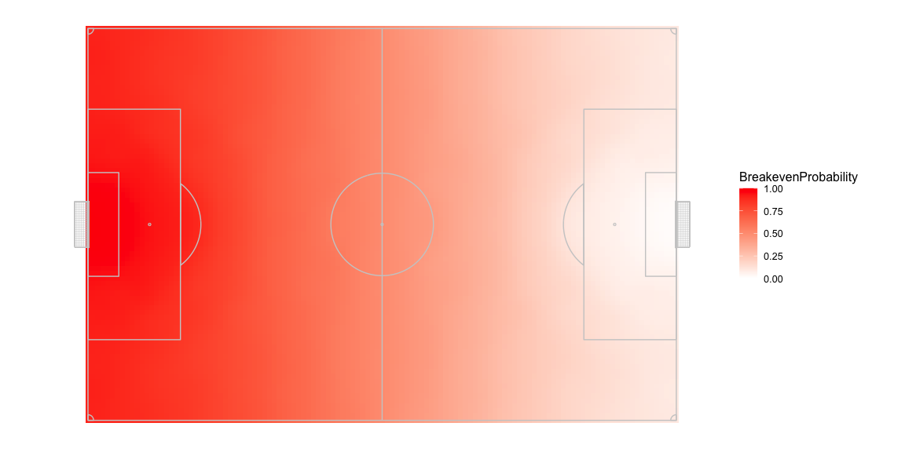
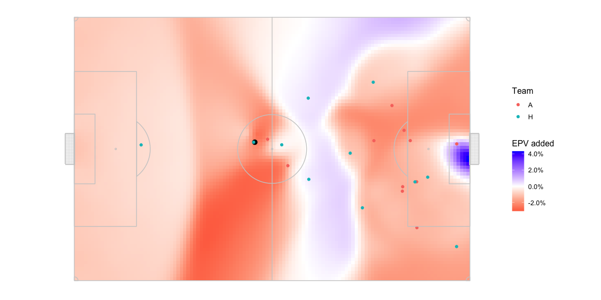
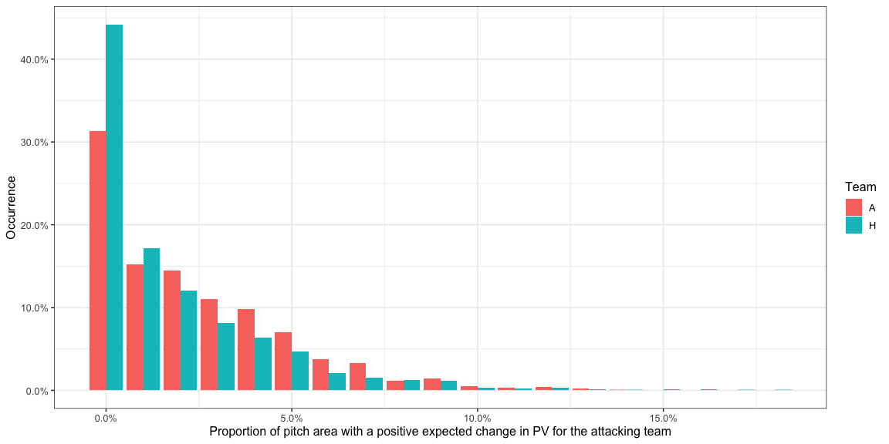

This is a thinking out loud kind of post. A bunch of basic charts and
numbers are here which should be enough to give an idea of what I’m
proposing. I want to think about this some more, which is usually a long
and slow process because life gets in the way, before doing a version
with nice looking vizes, etc. + also get feedback and comments from you
guys.

# Introduction

<http://www.lukebornn.com/papers/fernandez_sloan_2019.pdf> comes up with
a probabilistic possession value based on combining the possession value
of the part of the pitch, the probability of the ball being controlled
in the part of the pitch from pitch control, and the probability of the
ball being played to that part of the pitch from an action likelihood
model. These numbers can then be used to infer passing tendencies,
awareness, positioning, and many other things.

We’ll exclude action likelihood for now, because I want to fairly
evaluate any opportunity across the pitch without

Pitch control and probably action likelihood are *outcome* based models.
Pitch control tells you the probability of controlling the ball if it
were played to that part of the pitch. Action likelihood is also
probably based on data from what *happened* in actual matches. An
additional aspect we need to model to evaluate things like player
decision making is *intention*.

## Methodology

### Pitch Control

Pitch control tells you the probability of a team and its players
controlling the ball at various parts of the pitch if the ball were to
be passed there. This is done for each instant of the game and changes
based on the positions of the players and their movement.

I use Spearman’s model but you could probably swap it out for any other
model too.

### Possession Value

The probability of scoring at the end of a play / in the next some moves
/ in the next some seconds once the team has a ball in a particular part
of the pitch.

I’ve used the PV grid at
<https://raw.githubusercontent.com/Friends-of-Tracking-Data-FoTD/LaurieOnTracking/master/EPV_grid.csv>
which looks like this for the team attacking left to right -

We can rotate the pitch 180 degrees and get the PV values for the
respective part of the pitch for the opposition since that team is
attacking right to left.

Note how the probability sharply climbs close to 50% near the opposition
goal but is quite low for most of the pitch.

You should be able to swap it out for another PV model, if you so
prefer.

### Model 3

I don’t have a good model for this yet and don’t know of o public one
either. I will try and explain what I’m doing without this model for
now. I can’t say how much the results carry over when this model gets
included though.

### Combining Pitch Control and Possession Value

You should be able to combine these to evaluate what passing options
offer progress to the team in possession.

-   The team in possession already has a certain PV depending on where
    they have the ball: `AttackOriginPV`
-   The defending team is equally at risk of conceding a goal from that
    position, so the `DefenseOriginPV = -AttackOriginPV`
-   Assuming it is possible to pass to every point on the pitch,
    `(x,y)`, the PV for each target location can be calculated for both
    the teams, `AttackTargetPV_xy` and `DefenseTargetPV_xy`
-   At every point on the pitch, `(x,y)`, the attacking team has a
    probability of keeping control of the ball, `AttackProbabilty_xy`,
    and therefore the defending team’s probability is
    `DefenseProbabilty_xy = 1 - AttackProbabilty_xy`
-   At every point, `(x,y)`, we can estimate an expected PV for playing
    a pass there:
    -   For the attacking team,
        `ExpectedAttackTargetPV = ( AttackProbabilty_xy * AttackTargetPV_xy ) - ( DefenseProbabilty_xy * DefenseTargetPV_xy )`
    -   For the defending team, which is the same as the above formula
        with the attacking / defending terms exchanged,
        `ExpectedDefenseTargetPV = ( DefenseProbabilty_xy * DefenseTargetPV_xy ) - ( AttackProbabilty_xy * AttackTargetPV_xy )`
-   The change in PV from the current position can be calculated as the
    difference of the above terms from the PV of the starting position:
    -   For the attacking team,
        `ExpectedAttackingDeltaPV_xy = ExpectedAttackTargetPV_xy - AttackOriginPV`
    -   For the defending team,
        `ExpectedDefenseingDeltaPV_xy = ExpectedDefenseTargetPV_xy - DefenseingOriginPV`

Given we know the PV of each part of the pitch for both teams, and we
know that the probability of controlling the ball for both teams must
add up to 1 in each part of the pitch, we can calculate the minimum
value `ExpectedAttackTargetPV_xy` must be in each part of the pitch for
it to compensate for `ExpectedDefenseingDeltaPV_xy`, and therefore we
can also calculate the minimum value `AttackProbabilty_xy` should be for
`ExpectedAttackTargetPV_xy` to attain the necessary value. Think of this
value for `AttackProbabilty_xy` as a kind of breakeven probability. This
is what those probabilities look like -

Note how the breakeven probabilities are very low close to the
opposition goal, because in that area the PV is very high for the
attacking team compared to the PV for the defending team. In fact right
at the goal mouth, the breakeven probability is 0.0146577. This part of
the pitch is a little hard to work with though because goalkeepers are
also modelled as outfield players in this pitch control model whereas in
reality they would actually exert far greater control than the model
gives them credit for because they can use their hands, grab the ball in
the air, dive, etc. which the other players cannot do. The pitch control
models don’t model shots either, it models passes, so the idea of
‘passing to the goal’ is aso a little odd. We will see later that this
situation occurs in very few frames though so for now we will pretend
this isn’t a problem and carry on.

I also ignore the possibility of passes that travel more than 2/3 the
length of the pitch. Only Ederson can make such passes. We consider the
area that is within a radius of 2/3 length of the pitch at any point of
time and ignore everything outside of it.

We can expect `ExpectedDefenseDeltaPV_xy` to be positive very often,
since `DefenseOriginPV` is a negative value so the more interesting
thing to analyse would be `ExpectedAttackingDeltaPV_xy`. A positive
`ExpectedAttackingDeltaPV_xy` implies that passing the ball to that
point on the pitch is likely to increase the chance of scoring even
after considering the risk of conceding the ball.

## Demonstration

### An Example Frame

I use one frame to give an example of how all that I said above comes
together. I chose this example because it also highlights the problem I
mentioned above while hopefully also giving you an idea of the concept.

Here is what the pitch control looks like in one of the frames. In my
calculations I exclude players that are offside so the two players from
the blue team in the offside position have zero contribution to pitch
control.

When you overlay the possession value and do all those calculations
listed above, this is what the pitch looks like in terms of
`ExpectedAttackingDeltaPV_xy`.

There is some territory in the middle of the pitch where passing the
ball is expected to return a positive `ExpectedAttackingDeltaPV_xy`. And
then there is the tricky area near the opposition goal, which has a
larger `ExpectedAttackingDeltaPV_xy` than the middle of the pitch. As a
result of this problem, the logic above would suggest that in this
situation the optimal action for the team in possession, the blue team,
should be to pass the ball all the way to the goal and hope that the
small chance of another player from the same team controlling the ball
pays off for the high reward you’d get from successfully controlling the
ball at that location.

### Full game

I’ll use game 1 from Metrica Sports’ release available here -
<https://github.com/metrica-sports/sample-data/tree/master/data/Sample_Game_1>
to show some uses for this approach.

#### Team - Distributions

Let us look at the proportion of the pitch that offers a net gain in
expected PV for the attacking team. This is simply checking how much of
the area of the pitch offers a positive `ExpectedAttackingDeltaPV_xy` at
each instant the team had possession of the ball.

-   Most of the time there is a very small part of the pitch, if at all,
    that offers a positive net expected delta PV for the attacking team.
-   30% to 40% of the time there is less than 1% of the pitch which
    offers a positive `ExpectedAttackingDeltaPV_xy` for both the teams.
    It is exactly 0 in 19% when the home team has the ball and 11% when
    the away team has the ball. A value of 0% means the team in
    possession of the ball has no options on the pitch to pass to where
    they are expected to increase their chances of scoring by enough to
    negate the chance of conceding and have to pass it to lower
    possession value part of the pitch. This is very important because a
    number of times a pass is played to retain possession and not
    necessarily increase the chance of scoring and the typical way PV is
    applied would give these passes a negative score which is unfair. We
    will see how we can right this injustice later in the post.
-   There is almost never a situation where more than 15% of the area of
    the pitch offers a positive `ExpectedAttackingDeltaPV_xy` for the
    attacking team.
-   The away team usually has options over a bigger area of the pitch
    than the home team.

Let us look at the values of the `ExpectedAttackingDeltaPV_xy` itself.

If the team were to randomly pass to any point on the pitch, at each
instant of the game, what delta PV could they expect?

-   From the earlier histogram, we saw most of the pitch usually offers
    a negative expected delta PV so it isn’t surprising that this
    distribution is completely in the negative. What this means is that
    a random pass is more likely to help the defending team than an
    attacking team.

If we had a model to predict probabilities of passing to areas on the
pitch that would have been nice but we don’t. Instead, we’ll look at the
maximum `ExpectedAttackingDeltaPV_xy` at any instant as that number is
more indicative of the best option to pass for the attacking team at any
instant.

Most of the time, the best option offers an
`ExpectedAttackingDeltaPV_xy` between -1% and 2% for both teams:

<table>
<thead>
<tr>
<th style="text-align:left;">
Team
</th>
<th style="text-align:left;">
HighAttackMaxDeltaPVIntent\_pct
</th>
</tr>
</thead>
<tbody>
<tr>
<td style="text-align:left;">
A
</td>
<td style="text-align:left;">
96%
</td>
</tr>
<tr>
<td style="text-align:left;">
H
</td>
<td style="text-align:left;">
95%
</td>
</tr>
</tbody>
</table>

The proportion of time above 2% is -

<table>
<thead>
<tr>
<th style="text-align:left;">
Team
</th>
<th style="text-align:left;">
LowAttackMaxDeltaPVIntent\_pct
</th>
</tr>
</thead>
<tbody>
<tr>
<td style="text-align:left;">
A
</td>
<td style="text-align:left;">
3%
</td>
</tr>
<tr>
<td style="text-align:left;">
H
</td>
<td style="text-align:left;">
4%
</td>
</tr>
</tbody>
</table>

While the gain in PV might be large if some of these passes are
successful, when you balance them out for the probability of those
passes being unsuccessful, then the team in possession doesn’t usually
have a chance to attempt an action which offers a high probability large
gain in PV.

#### Team - observations in time

-   Most of the high value expected delta PV for the attacking team, for
    either of the teams, is concentrated in time, which means they are
    just multiple frames from a much fewer number of instances. For the
    most part the teams operate in a very low expected reward sort of
    situation.

-   You can see some patterns across the game, for instance the home
    team had a couple of very good chances to progress the ball towards
    the start of the game and had other chances through the game as
    well, while the away team had many good chances to progress the ball
    towards the end of the game but not much during the earlier part of
    the game.

#### Team - observations in space

The location of the highest expected delta PV at each instant during the
sample of frames looks like as below.

-   The home team creates a lot more opportunities to progress the ball
    through the central areas in their own half compared to the away
    team that relies more heavily on opportunities wider areas. Wider
    areas are usually much more popular as a target though.
-   If you look at the area in the defensive halves, note how the away
    team more often presents the best opportunity towards the left,
    whereas the home team has better options more often on the right
    side deeper in their own half, and more often on the left side more
    advanced in their own half.

### Instances of high positive expected delta PV

Let’s see what sort of potential passes show up if we filter for the
maximum `ExpectedAttackingDeltaPV_xy` value at any frame &gt;
AttackDeltaPVThreshold. Again, these are potential passes that *could*
have been played and not necessarily the actual pass that was played at
the time. There may also have been more than one such pass at any frame
but we will pick only the one with the maximum
`ExpectedAttackingDeltaPV_xy` value. It’s also likely that during the
course of the play, a similar kind of pass continued to remain the
optimal choice and you would therefore see it multiple times. We can
figure out a way to isolate unique passes and I can keep track of other
high value passes even if they aren’t the optimal but for now this is
all we have.

-   Lots of diagonal balls from deep in the defensive half to the wings.
-   Lots of good opportunities to cross from the deep left for the away
    team.
-   The home team has opportunities from all sorts of places to put the
    ball in the box.
-   The away team has quite a few of these high
    `ExpectedAttackingDeltaPV_xy` passes targeted towards the centre of
    the box whereas the home team has them spread all over the box.

## Adjusting for passing ability

A lot of the high positive expected delta PV passes are quite long
passes or at the edges of the pitch. Long passes are likely to fetch
more PV because it usually gets you much closer to the goal from where
you were before. Edges of the pitch are likely more attractive because
Defenders will tend to stay towards the inside of attacking players. It
is also much harder to execute such passes. The risk of passing the ball
out of bounds, or not being able to pass exactly to the point a player
wants to is much higher for these passes than it would be for less
rewarding passes. Until now we were looking at an outcome based
`ExpectedAttackingDeltaPV_xy` but if we now switch it to an intention
based `ExpectedAttackingDeltaPV_xy` then we would need to incorporate
these risks in the reward we assign to an action.

To incorporate that, I add some noise to the pass end location as a
function of the length of the pass. What this noise basically does is
that it assumes that a pass targeted at a particular location x,y could
go anywhere in the neighbourhood of x,y depending on how far x,y is from
the pass origin location. The longer the pass, the more the magnitude of
the noise. For passes towards the edges of the pitch, the probability
that a ball is passed out of bound is considered as a turnover with the
throw in being taken from the closest part of the pitch to the out of
bound location. The noise is spread as a two dimensional gaussian around
the target location being aimed at with the spread of the gaussian being
a function of the distance of the attempt pass.

There are things you can nitpick on as being too simplistic but again
this is about presenting the concept. I don’t have access to the kind of
data required to merit building a more robust model so I’m not even
going to try.

Here is how the numbers change with the updated
`ExpectedAttackingDeltaPV_xy`, which we will call
`IntentExpectedAttackingDeltaPV_xy`.

-   The distributions don’t move significantly but they do move a little
    bit towards the direction of lower possible gains. This makes sense,
    you’d expect ådding noise to reduce the optimal value.
-   Note the slightly lesser instances of the model suggesting that the
    pass should be right at the goal mouth or even at the edge of the
    pitch on the wings. Because in those cases, there is a chance of the
    ball going out of bounds as well which would mean handing over the
    ball to the other team. This reduces how attractive those locations
    are and the optimal locations move a little inwards. How much they
    move inside is likely an artifact of the way the noise has been
    incorporated in the model though, because the locations are still
    clumped tightly

Here is a distribution of the distance between the Intent optimal pass
location and the Outcome optimal pass location by the pass distance.

Longer passes are more likely to be in areas with small pockets of space
so the fact that we include the possibility of slightly wayward passes
means the reward of *intending* to pass to them reduces and the optimal
passes tend to become shorter. It’s a little odd that the longest passes
aren’t as compromised as the medium range passes though, and I suspect
it’s the goalkeeper area being tricky again. ( If I had to argue against
this I’d say that we use a distance based noise function because we
expect longer passes to be harder to execute and therefore The trend of
longer passes seeing a more drastic change might be a self-fulfilling
result. )

As an illustration -

