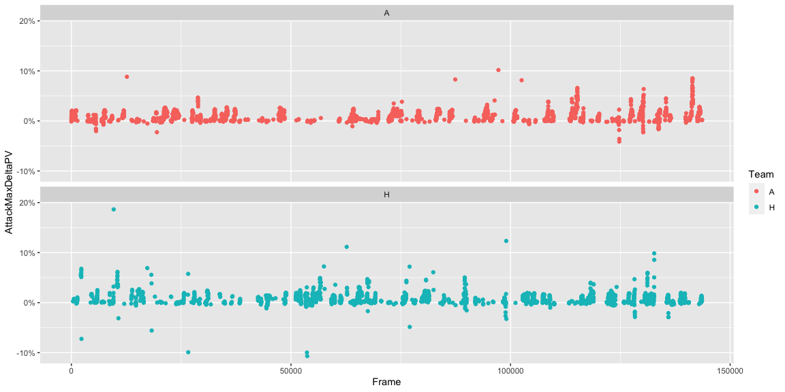
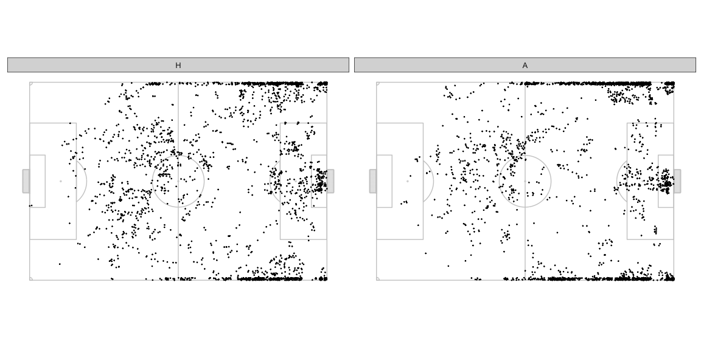
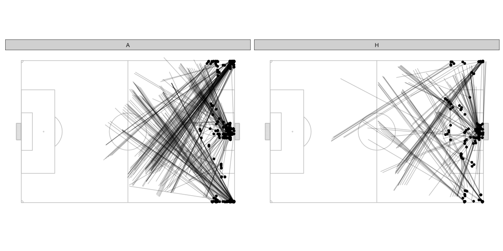
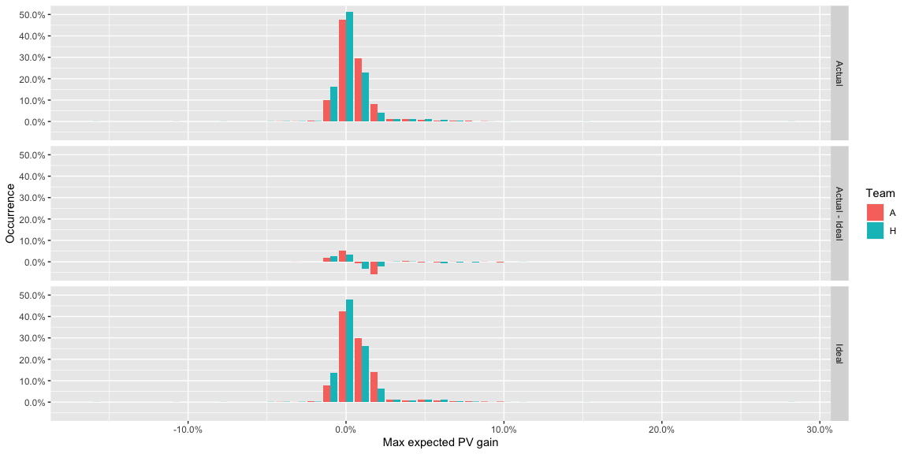
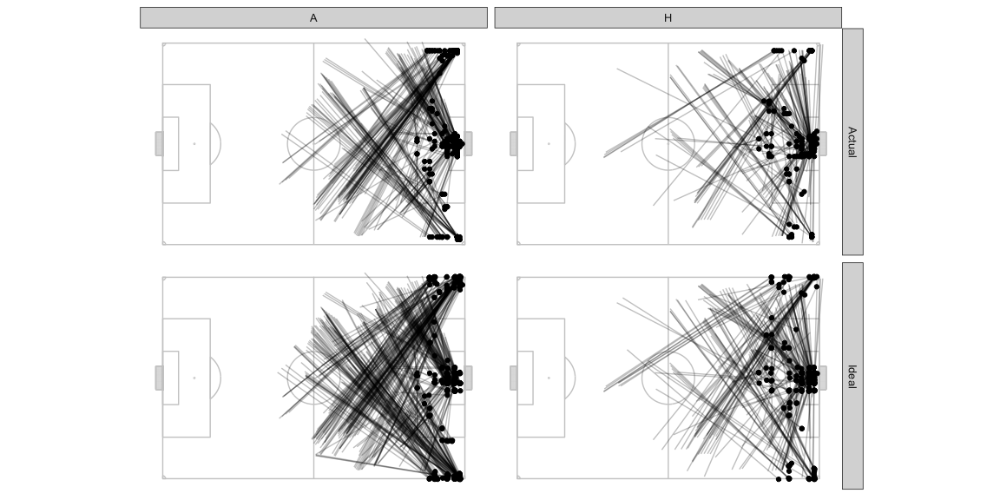
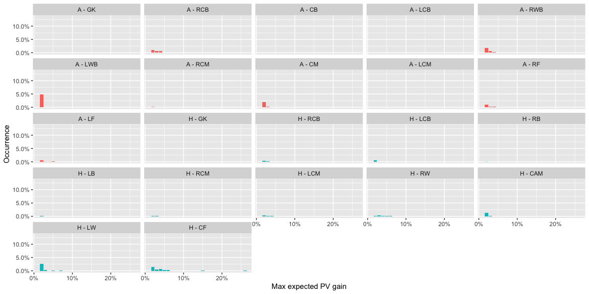
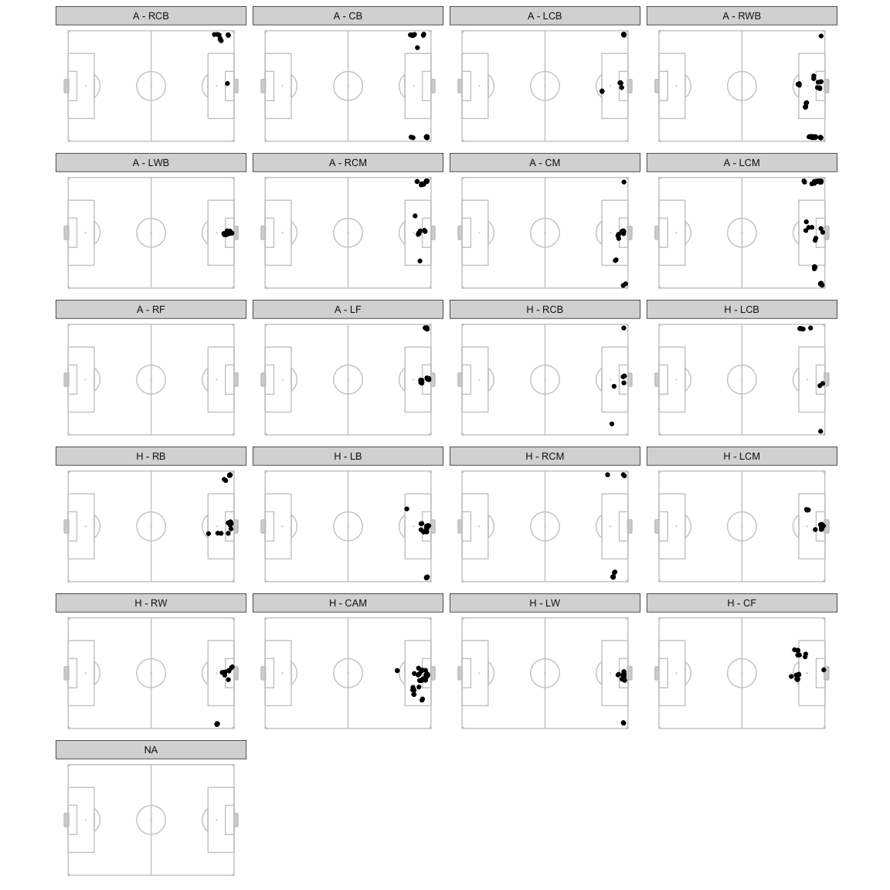

Using possession value to measure the value of the actions of players is
a commonly seen statistic on Twitter now. These are usually on ball
ations though. A question I’ve been thinking about is how can we value
off ball actions.

Using pitch control, we can estimate the probability of players
controlling the ball in various parts of the pitch so we could simulate
passes that didn’t actually happen to estimate how much value a player
could have added from passes they *could* have received. This is not the
same as estimating the value of their off ball actions but more like an
adjustment for the fact that not every player in the team will receive
as many passes, etc.

As I played around with these numbers though, I felt like there is more
utility that they offer than just player valuations so I though I’d put
out a rough version of what I’ve been doing as a thinking out loud kind
of post. If you have ideas or inputs on this then let’s talk. I’m on
Twitter as @thecomeonman, or email mail dot thecomeonman at gmail.

## Methodology

### Pitch Control

Pitch control tells you the probability of controlling the ball at
various parts of the pitch, or the opponent controlling the ball at
various parts of the pitch.

### Possession Value

The probability of scoring at the end of a play once the team has a ball
in a particular part of the pitch.

I’ve used the PV grid here -
<https://raw.githubusercontent.com/Friends-of-Tracking-Data-FoTD/LaurieOnTracking/master/EPV_grid.csv>
which looks like -

We can just visually flip the pitch around and get the PV values for the
respective part of the pitch for the opposition.

### Combining Pitch Control and Possession Value

You should be able to combine these to evaluate what passing options
offer progress to the team in possession.

-   The team in possession has a certain PV depending on where the ball
    is: `AttackingOriginPV`
-   The defending team is equally in risk of conceding a goal from that
    position, so the `DefendingingOriginPV = -AttackingOriginPV`
-   At each point on the pitch, xy, the PV can be calculated for each of
    the teams as well, `AttackingTargetPV_xy` and `DefendingTargetPV_xy`
-   At each point on the pitch, xy, the attacking team has a probability
    of keeping control of the ball, `AttackingTeamProbabilty_xy`, and
    therefore the defending team’s probability of
    `DefendingTeamProbabilty_xy = 1 - AttackingTeamProbabilty_xy`
-   At each point, xy, we can estimate an expected PV:
    -   For the attacking team,
        `ExpectedAttackingTargetPV = ( AttackingTeamProbabilty_xy * AttackingTargetPV_xy ) - ( DefendingTeamProbabilty_xy * DefendingTargetPV_xy )`
    -   For the defending team, which is the same as the above formula
        with the attacking / defending terms exchanged,
        `ExpectedDefendingTargetPV = ( DefendingTeamProbabilty_xy * DefendingTargetPV_xy ) - ( AttackingTeamProbabilty_xy * AttackingTargetPV_xy )`
-   And the change in PV from the current position can be calculated as
    the difference of the above terms from the PV of the starting
    position:
    -   For the attacking team, \`ExpectedAttackingDeltaPV\_xy =
        ExpectedAttackingTargetPV\_xy - AttackingOriginPV
    -   For the defending team,
        `ExpectedDefendingDeltaPV_xy = ExpectedDefendingTargetPV_xy - DefendingOriginPV`

Given we know the PV of each part of the pitch for both teams, and we
know that the probability of controlling the ball for both teams must
add up to 1 in each part of the pitch, we can calculate the minimum
value `ExpectedAttackingTargetPV_xy` must be in each part of the pitch
for it to compensate for `ExpectedDefendingDeltaPV_xy`, and therefore we
can also calculate the minimum value `AttackingTeamProbabilty_xy` should
be for `ExpectedAttackingTargetPV_xy` to attain the necessary value.
Think of this value for `AttackingTeamProbabilty_xy` as the breakeven
probability. This is what that would look like.

Note how the breakeven probabilities are very small close to the
opposition goal, because in that area the PV is very high for the
attacking team compared to the PV for the defending team. In fact right
at the goal mouth, the breakeven probability is 0.0146577. This part of
the pitch is a little hard to work with though because goalkeepers are
also modelled as outfield players in this pitch control model whereas in
reality they would actually exert far greater control than the model
gives them credit for because they can use their hands, grab the ball in
the air, dive, etc. which the other players cannot do. The pitch control
models don’t model shots either, it models passes, so the idea of
‘passing to the goal’ is a little odd anyway. We will see later that
this situation occurs in very few frames though so for now we will
pretend this isn’t a problem and carry on.

I also ignore the possibility of passes that travel more than 2/3 the
length of the pitch. Only Ederson can make such passes. We consider the
area that is within a radius of 2/3 length of the pitch at any point of
time and ignore everything outside of it.

We can expect `ExpectedDefendingDeltaPV_xy` to be positive very often,
since `DefendingOriginPV` is a negative value so the more interesting
thing to analyse would be how often `ExpectedAttackingDeltaPV_xy` is
positive. A positive `ExpectedAttackingDeltaPV_xy` implies that passing
the ball to that point on the pitch is likely to increase the chance of
scoring even after considering the risk of conceding the ball.

## Illustration

I chose this examples because it also highlights the problem I mentioned
above while hopefully also giving you an idea of the concept.

In my calculations I exclude players that are offside so the two players
from the blue team in the offside position offer zero pitch control.

Here is what the pitch control looks like in a frame -

When you overlay the possession value and do all those calculations
listed above, this is what the pitch looks like in terms of expected
possession value gain for the attacking team

There is some territory in the middle of the pitch where passing the
ball is expected to return a positive delta PV. And there is the tricky
area near the opposition goal, which has a larger expected delta PV than
the middle of the pitch. In this case, the logic above would suggest
that the team in possession, the blue team, should pass the ball all the
way to the goal.

## Observations

### Team level

What are the trends in terms of proportion of the the pitch that offers
a net gain in expected PV for the attacking team?

-   Most of the time there is a very small part of the pitch, if at all,
    that offers a positive net expected delta PV for the attacking team.
-   30% to 40% of the time there is less than 1% of the pitch which
    offers a positive net expected delta PV. It is exactly 0 in 14% when
    the home team has the ball and 9% when the away team has the ball.
    0% means the team in possession of the ball has no option on the
    pitch to pass to where they are expected to increase their chances
    of scoring by enough to negate the chance of conceding and have to
    pass it to lower possession value part of the pitch. The bigger the
    number, the better the other defending team’s defending or the worse
    the attacking team’s attacking
-   There is almost never a situation where more than 15% of the area of
    the pitch offers a positive net expected delta PV for the attacking
    team.
-   The away team usually has options over a bigger area of the pitch
    than the home team.

Let us look at the values of the expected delta PV gain itself.

If the team were to randomly pass to any point on the pitch, what delta
PV could they expect?

Most of the pitch is usually negative expected delta PV so it isn’t
surprising that this distribution is almost completely in the negative.

We’ll focus on the maximum expected delta PV gain at any instant as that
is indicative of the best option to pass for the attacking team.

-   Around 95% of the distribution lies between -1% to 3% This means
    most of the time the optimal action available to the attacking team
    is expected to fetch them very little gain, if at all.

### Team - Time level trends

-   Most of the high value expected delta PV for the attacking team, for
    either of the teams, is concentrated in time. The very few instances
    of high positive expected delta PV aren’t spread out over time and
    are usually just multiple frames from a much fewer number of
    instances. This means that for the most part the teams operate in a
    very low expected reward sort of situation and it is rare for a team
    to get a good opportunity to significantly progress the ball.
-   You can see some patterns across the game, for instance the home
    team had a couple of very good chances to progress the ball towards
    the start of the game and through the game as well, while the away
    team had many good chances to progress the ball towards the end of
    the game but not much during the earlier part of the game.

### Team - Space level trends

Note - home team attacks to the right, away team to the left

The location of the highest expected delta PV at each instant during the
sample of frames is plotted

-   The home team creates a lot more opportunities to progress the ball
    through the central areas in their own half compared to the away
    team that relies more heavily on opportunities wider areas.
-   Both team have a preference towards creating opportunities on the
    left side of the centre of the pitch, a lot more skewed for the away
    team though.

### Instances of high positive expected delta PV

Since high positive expected delta PV are concentrated in time, let us
isolate one instance from each stretch of high positive expected delta
PV and plot them to see what sort of patterns emerge -

-   Lots of good opportunities to cross from the deep left for the away
    team. The home team has crossing opportunities from all sorts of
    places but they seem to have really good opportunities from what
    looks like corners taken from the left.
-   Diagonal balls are good opportunities
-   There are quite a few other less frequently occurring passes

## Adjusting for passing ability

A lot of the high positive expected delta PV passes are quite long
passes, and long passes are likely to fetch more PV because it usually
gets you much closer to the goal from where you were before. But it is
also much harder to execute such passes. To incorpoate that, I add some
noise to the pass end location as a function of the length of the pass.
The longer the pass, the more the magnitude of the noise. Not going into
the details of the exact function of adding noise for now. What this
noise basically does is that it assumes that a pass targeted at a
particular location x,y could go anywhere in the neighbourhood of x,y
depending on how far x,y is from the pass origin location. Therefore the
pitch control and the possession value calculations should be updated to
say that if the target of the pass was x,y then the ball could end up in
these other places as well and the resultant pitch control and
possession should take into account those possibilities as well.

If we do that, here is how the numbers change. Not significantly, but
slightly. I’m calling this set of numbers the actual numbers and the
earlier set of numbers the ideal numbers.

-   The distributions don’t move noticeably but if you compare the
    corresponding bars, there are differences of a few percent points.
-   Note the slightly lesser instances of the model suggesting that the
    pass should be right at the goal mouth or even at the edge of the
    pitch on the wings. Because in those cases, there is a chance of the
    ball going out of bounds as well which would mean handing over the
    ball to the other team. This reduces how attractive those locations
    are and the optimal locations move a little inwards.
-   Some other high expected delta PV passes are also gone and replaced
    with some others.

### Player level - Recipient

We calculated `ExpectedAttackingDeltaPV_xy` and
`ExpectedDefendingDeltaPV_xy` above. We can now distribute that amongst
the players of the attacking and defending team respectively in
proportion to their pitch control probability at that part of the pitch:

-   `PlayerExpectedAttackingDeltaPV_xy = ExpectedAttackingDeltaPV_xy * PlayerPitchControlProbability_xy / AttackingTeamPitchControlProbability_xy`
-   `PlayerExpectedDefendingDeltaPV_xy = ExpectedDefendingDeltaPV_xy * PlayerPitchControlProbability_xy / DefendingTeamPitchControlProbability_xy`

The max of these values across the entire space of the pitch at each
instant during the game tells us what is the best option an individual
player offers. Various aggregations of these values over the game could
give us an indication of the contribution of a player.

We will use the actual version of the numbers and not the ideal version
of the numbers.

-   Again, almost all of it lies between -1% to 1%.
-   The away team is a little better than the home team though, with
    more of occurrence in the 0% to 1% band and less in the -1% to 0%
    compared to the home team.

Let us filter this out for cases where the value is greater than 1%.

-   The occurrence is very low, which we could already have guessed from
    the team level distributions.
-   There is likely a right sided bias to the away team with the RCB,
    the RF, and the RWB showing higher occurrence.
-   The home team seems overly reliant on the CF and LW to provide good
    opportunities though.

If we were to look at the whole pitch, and not just the optimal point on
the pitch for each player, the expected delta PV distribution for each
individual player looks like this -

-   Note the away RWB, away CM, away LF, home RW, home LW, home CF
    having a concentration of space in terms of where they had high
    delta PV opportunities to win the ball.
-   For most of the others, the rare few occurrences of high expected
    delta PV are at the goal, likely because the PV at that point is
    much higher than points around. This might be an artifact of the PV
    function which might go away with a better PV function.

### Player level - Passer

Usually the passer is credited with the PV gained from a pass so we
should also look at what opportunities the rest of the team presents to
them, including the player in possession themselves.

### Using Player Level Metrics To Evalaute Player Performance

At each stretch of possession for a player, they have multiple
opportunities to play a pass. Using the metric of expected delta PV, we
can evaluate what kind of choices they had during that stretch of
possession and compare it to the choice they finally made and how sub
optimal that choice was. Players who have an eye for good passes should
make choices close to optimal very often. Have to add this bit of code.
