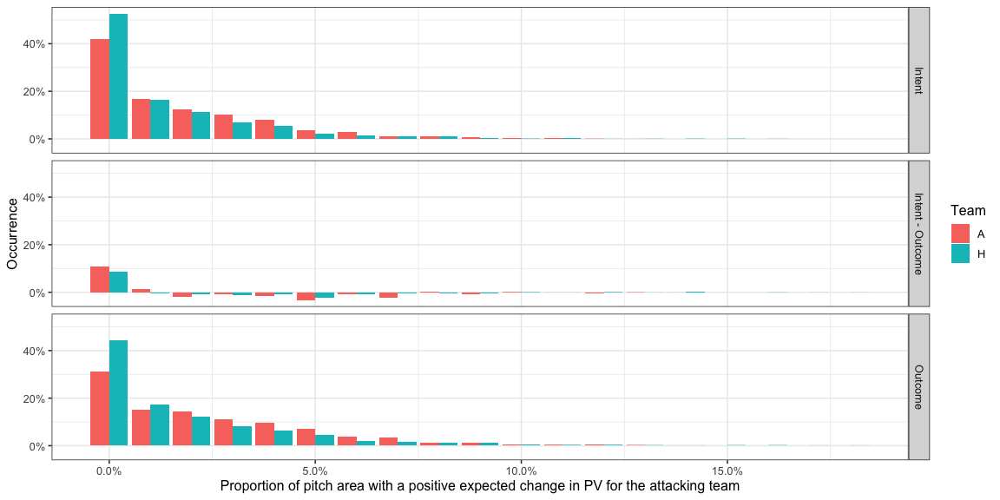
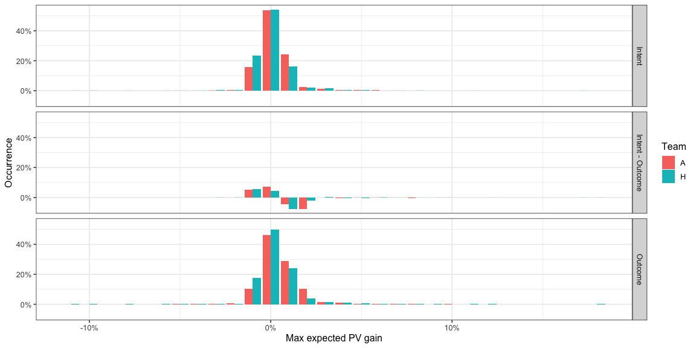
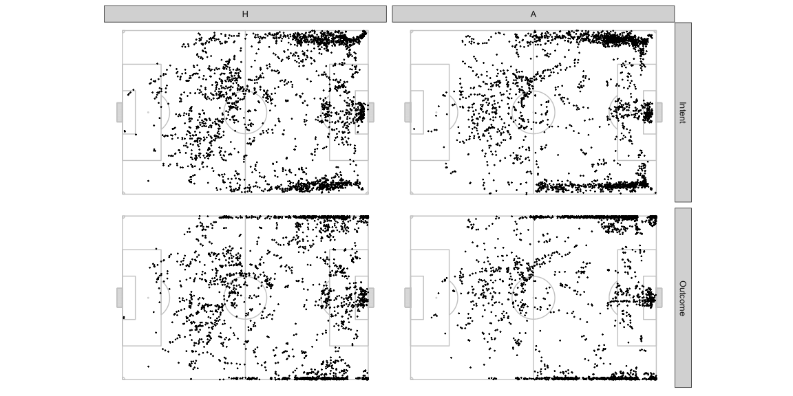
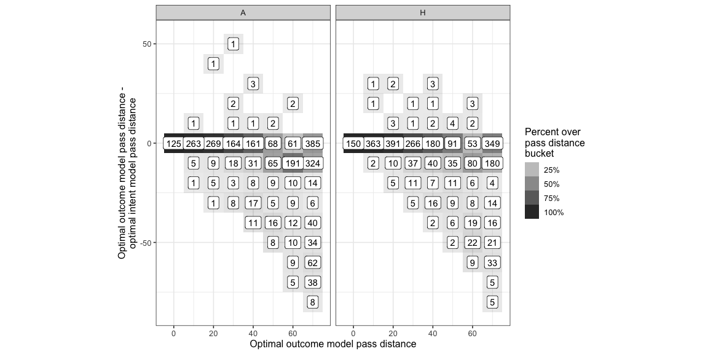

This is a thinking out loud kind of post. A bunch of basic charts and
numbers are here which should be enough to give an idea of what I’m
proposing. I want to think about this some more, which is usually a long
and slow process because life gets in the way, before doing a version
with nice looking vizes, etc. + also get feedback and comments from you
guys.

# Introduction

<http://www.lukebornn.com/papers/fernandez_sloan_2019.pdf> comes up with
a probabilistic possession value based on combining the possession value
of the part of the pitch, the probability of the ball being controlled
in the part of the pitch from pitch control, and the probability of the
ball being played to that part of the pitch from an action likelihood
model. These numbers can then be used to infer passing tendencies,
awareness, positioning, and many other things.

Pitch control and action likelihood are *outcome* based models. Pitch
control tells you the probability of controlling the ball if it were
played to that part of the pitch. Action likelihood is also probably
based on data from what *happened* in actual matches. An additional
aspect we need to evaluate things like player decision making is
*intent*. That’s what the rest of the post is about.

We’ll exclude action likelihood and only look at the output just from
the possession value and the pitch control models. This lets us evaluate
any opportunity across the pitch without prejudice for what players tend
to do in that situation.

If you’re familiar with pitch control and possession value, you can
probably just glance at the Glossary section and then skip straight to
the Intent vs. Outcome section.

## Methodology

### Pitch Control

Pitch control tells you the probability of a team and its players
controlling the ball at various parts of the pitch if the ball were to
be passed there. This is done for each instant of the game and changes
based on the positions of the players and their movement.

I use Spearman’s model but you could probably swap it out for any other
model too. Note that this is not the model used in the linked paper.

### Possession Value

The probability of scoring at the end of a play / in the next some moves
/ in the next some seconds once the team has a ball in a particular part
of the pitch.

I’ve used the PV grid at
<https://raw.githubusercontent.com/Friends-of-Tracking-Data-FoTD/LaurieOnTracking/master/EPV_grid.csv>
which looks like this for the team attacking left to right -

We can rotate the pitch 180 degrees and get the PV values for the
respective part of the pitch for the opposition since that team is
attacking right to left.

Note how the possession value sharply climbs close to 50% near the
opposition goal but is quite low for most of the pitch.

You should be able to swap it out for another PV model, if you so
prefer. Note that this is not the model used in the linked paper.

### Glossary

You should be able to combine these to evaluate what passing options
offer progress to the team in possession.

-   The team in possession already has a certain PV depending on where
    they have the ball: `AttackOriginPV`
-   The defending team is equally at risk of conceding a goal from that
    position, so the `DefenseOriginPV = -AttackOriginPV`
-   Assuming it is possible to pass to every point on the pitch,
    `(x,y)`, the PV for each target location can be calculated for both
    the teams, `AttackTargetPV_xy` and `DefenseTargetPV_xy`
-   At every point on the pitch, `(x,y)`, the attacking team has a
    probability of keeping control of the ball, `AttackProbabilty_xy`,
    and therefore the defending team’s probability is
    `DefenseProbabilty_xy = 1 - AttackProbabilty_xy`
-   At every point, `(x,y)`, we can estimate an expected PV for playing
    a pass there:
    -   For the attacking team,
        `ExpectedAttackTargetPV = ( AttackProbabilty_xy * AttackTargetPV_xy ) - ( DefenseProbabilty_xy * DefenseTargetPV_xy )`
    -   For the defending team, which is the same as the above formula
        with the attacking / defending terms exchanged,
        `ExpectedDefenseTargetPV = ( DefenseProbabilty_xy * DefenseTargetPV_xy ) - ( AttackProbabilty_xy * AttackTargetPV_xy )`
-   The change in PV from the current position can be calculated as the
    difference of the above terms from the PV of the starting position:
    -   For the attacking team,
        `ExpectedAttackDeltaPV_xy = ExpectedAttackTargetPV_xy - AttackOriginPV`
    -   For the defending team,
        `ExpectedDefenseDeltaPV_xy = ExpectedDefenseTargetPV_xy - DefenseOriginPV`
        A positive `ExpectedAttackDeltaPV_xy` implies that passing the
        ball to that point on the pitch is likely to increase the chance
        of scoring even after considering the risk of conceding the
        ball. A negative value implies that passing the ball to that
        point is likely going to decrease the chance of scoring.
-   At any point, the optimal action for the attacking team to perform
    should be to move the ball to a point which offers the highest
    `ExpectedAttackDeltaPV_xy`. We’ll call this value
    `ExpectedAttackMaxDeltaPV`. This value may not always be positive.

I ignore the possibility of passes that travel more than 2/3 the length
of the pitch. Only Ederson can make such passes. We consider the area
that is within a radius of 2/3 length of the pitch at any point of time
and ignore everything outside of it.

We can expect `ExpectedDefenseDeltaPV_xy` to be positive very often,
since `DefenseOriginPV` is a negative value so the more interesting
thing to analyse would be `ExpectedAttackDeltaPV_xy`.

## Demonstration

### An Example Frame

I use one frame to give an example of how all that I said above comes
together. I chose this example because it also highlights the problem I
mentioned above while hopefully also giving you an idea of the concept.

Here is what the pitch control looks like in one of the frames. In my
calculations I exclude players that are offside so the two players from
the blue team in the offside position have zero contribution to pitch
control.

When you overlay the possession value and do all those calculations
listed above, this is what the pitch looks like in terms of
`ExpectedAttackDeltaPV_xy`.

There is some territory in the middle of the pitch where passing the
ball is expected to return a positive `ExpectedAttackDeltaPV_xy`. And
then there is the odd area near the opposition goal, which has a larger
`ExpectedAttackDeltaPV_xy` than the middle of the pitch. This area
lights up because the goalkeeper isn’t given extra powers to control the
ball in the pitch control model which is not the case in real life since
keepers can catch the ball with their hands, dive on it, etc. As a
result of this inconsistency, the logic above would suggest that in this
situation the optimal action for the team in possession, the blue team,
should be to pass the ball all the way to the goal and hope that the
small chance of another player from the same team controlling the ball
pays off for the high reward you’d get from successfully controlling the
ball at that location.

### Full game

I use game 1 from Metrica Sports’ release available here -
<https://github.com/metrica-sports/sample-data/tree/master/data/Sample_Game_1>.
The findings WRT to the home and away team obviously don’t carry over to
all games.

#### Team - Distributions

Let us look at the proportion of the pitch that offers a positive
`ExpectedAttackDeltaPV_xy` at each instant the team had possession of
the ball.

-   Most of the time there is a very small part of the pitch, if at all,
    that offers a positive net expected delta PV for the attacking team.
    This means there is a very small part of the pitch that the
    attacking team can pass to and expect their possession value to go
    up when you factor the risk of conceding the ball.
-   30% to 40% of the time there is less than 1% of the pitch which
    offers a positive `ExpectedAttackDeltaPV_xy` for both the teams. It
    is exactly 0 in 19% when the home team has the ball and 11% when the
    away team has the ball. A value of 0% means the team in possession
    of the ball has no options on the pitch to pass to where they are
    expected to increase their chances of scoring by enough to negate
    the chance of conceding. This is very important because a number of
    times a pass is played just to retain possession and not necessarily
    increase the chance of scoring and the typical way PV is applied
    would give these passes a negative score which is unfair to the
    team.
-   There is almost never a situation where more than 15% of the area of
    the pitch offers a positive `ExpectedAttackDeltaPV_xy` for the
    attacking team.
-   The away team usually has options over a bigger area of the pitch
    than the home team.

Let us look at the values of the `ExpectedAttackDeltaPV_xy` itself.

If the team were to randomly pass to any point on the pitch, at each
instant of the game, what `ExpectedAttackDeltaPV_xy` could they expect?

-   From the earlier histogram, we saw most of the pitch usually offers
    a negative expected delta PV so it isn’t surprising that this
    distribution is completely in the negative. What this means is that
    a random pass is more likely to aid the defending team than an
    attacking team.

If we instead look at the best option the team has at any instant,
`ExpectedAttackMaxDeltaPV` -

Most of the time, the best option offers an `ExpectedAttackMaxDeltaPV`
between -1% and 2% for both teams:

<table>
<thead>
<tr>
<th style="text-align:left;">
Team
</th>
<th style="text-align:left;">
HighAttackMaxDeltaPVIntent\_pct
</th>
</tr>
</thead>
<tbody>
<tr>
<td style="text-align:left;">
A
</td>
<td style="text-align:left;">
96%
</td>
</tr>
<tr>
<td style="text-align:left;">
H
</td>
<td style="text-align:left;">
95%
</td>
</tr>
</tbody>
</table>

The proportion of time `ExpectedAttackMaxDeltaPV` is above 2% -

<table>
<thead>
<tr>
<th style="text-align:left;">
Team
</th>
<th style="text-align:left;">
LowAttackMaxDeltaPVIntent\_pct
</th>
</tr>
</thead>
<tbody>
<tr>
<td style="text-align:left;">
A
</td>
<td style="text-align:left;">
3%
</td>
</tr>
<tr>
<td style="text-align:left;">
H
</td>
<td style="text-align:left;">
4%
</td>
</tr>
</tbody>
</table>

#### Team - spatial observatinons

The location offering `ExpectedAttackMaxDeltaPV` at each instant during
the sample of frames looks like as below. Both teams have almost equal
possession so don’t worry too much about normalising this chart.

-   The home team creates a lot more opportunities to progress the ball
    through the central areas in their own half compared to the away
    team. The away team starts relying on wider areas as an outlet much
    earlier on the pitch compared to the home team.
-   If you look at the area in the defensive halves, note how the away
    team more often presents the best opportunity towards the left,
    whereas the home team has better options more often on the right
    side deeper in their own half, and more often on the left side more
    advanced in their own half.
-   The options in the box are quite concentrated in front of the goal
    mouth for the away team. The home team has a few sports around which
    they offer an option often.

### Instances of high positive expected delta PV

Let’s see what sort of potential passes that show up if we filter for
the `ExpectedMaxAttackDeltaPV_xy` value at any frame &gt;
`r`AttackDeltaPVThreshold`. Note that these are potential passes that _could_ have been played and not necessarily the actual pass that was played at the time. There may also have been more than one such pass at any frame but we will pick only the one with the`ExpectedMaxAttackDeltaPV\_xy\`
value. It’s also likely that during the course of the play, a similar
kind of pass continued to remain the optimal choice and you would
therefore see it multiple times.

-   Lots of diagonal balls from deep in the defensive half to the wings.
-   Lots of good opportunities to cross from the deep left for the away
    team. The home team also has slightly higher opportunities to put
    the ball in the box being created from the left wing but they have
    other options as well from other parts of the pitch.

## Intent vs. Outcome

This is point of this post. All the stuff above was just to get you
comfortable with the concepts.

Most high value `ExpectedAttackDeltaPV_xy` passes are long passes or at
the edges of the pitch. Long passes are likely to fetch more PV because
it usually gets you much closer to the goal from where the ball was
before. Edges of the pitch are more attractive because Defenders will
tend to stay towards the insides of the pitch leaving one side less for
a defensive impact on the attackers staying closer to the edges of the
pitch.

The reason I started writing is because while these are more rewarding
if they actually happen, it is also much harder to execute such passes.
The risk of passing the ball out of bounds, or not being able to pass
accurately to the point with the maximum expected delta PV is much
higher for such passes compared to easier passes to someone in the
middle of the pitch or someone closer to the player in possession. Until
now we were looking at an outcome based `ExpectedMaxAttackDeltaPV_xy`
i.e. the delta PV the team could expect to gain if the ball reached a
particular `(x.y)` but if we switch to an intention based
`ExpectedAttackDeltaPV_xy`, i.e. the delta PV the team could expect to
gain if the ball was attempted to be passed to a particular `(x.y)` then
we would need to incorporate these risks.

Let us assume that a pass targeted at a particular location x,y could go
anywhere in the neighbourhood of x,y depending on how far x,y is from
the pass origin location. To simulate this, I take the intended pass
target location and calculate an actual pass target location by adding
some noise to the intended coordinates as a function of the length of
the pass. The longer the pass, the more the magnitude of the noise. For
actual targets that go out of bounds the appropriate corner, goal kick,
or throw in is considered as the next event and the PV calculate is done
accordingly. The intent based model

The noise is spread as a two dimensional gaussian around the target
location being aimed at with the spread of the gaussian being a function
of the distance of the attempt pass. Think of this gaussian as
representing the probability of the pass actually reaching that actual
lacation when the intention of the pass was to reach the intended
location.

Now that we have these probabilities, we can calculate a new set of
pitch control and possession values for each intended target location by
aggregating the pitch control and possession value from all the actual
target locations in the neighbourhood of that intended target location
weighed by the the probability of that actual target location.

As an illustration, here is another frame -

The intent based versions are a little more gradual, less crisp in the
areas where both teams have similar probabilities of controlling the
ball. The parts of the pitch around the edges of the blue team dominated
areas are also a little faded out.

Here is what the delta between the two looks like. Note the change in
the colour scale -

A drop of up to ~35% in pitch control in some parts close to the edge.
Lesser magnitude drops in the middle of the pitch. Let’s exclude the
edges and see how much the central areas change by. Again note the
change in the colour scale -

Drops of +-3% can be seen in the areas away from the blue team dominated
edges of the pitch.

What difference does that translate to in terms of the
`ExpectedAttackDeltaPV_xy`

Given the low magnitudes of `ExpectedAttackDeltaPV_xy`, going from
outcome based to intent based chages the `ExpectedAttackDeltaPV_xy`
values by a few points as well.

The optimal intent based pass target location is quite far from the
optimal outcome based pass target location-

The target is still on the right wing, but near the centre line as per
the intent location whereas the outcome based optimal location is around
a quarter of the legnth of the pitch farther ahead.

### Change in overall distributions and trends

Here is how the distributions change -

You can see a shift in the distribution from having larger parts of the
pitch having a positive `ExpectedAttackDeltaPV_xy` in the outcome
version of the model to smaller parts of the pitch in the intent version
of the model. If you take into account the possible passing inaccuracy
of passes, the part of the pitch that offers a positive
`ExpectedAttackDeltaPV_xy` drops.

The other distributions also change in a similar manner -

-   The distributions move towards the direction of lower possible
    `ExpectedAttackMaxDeltaPV` This makes sense, you’d expect ådding
    noise would reduce the optimal value.
-   Note the slightly lesser instances of the model suggesting that the
    pass should be right at the goal mouth or even at the edge of the
    pitch on the wings. Because in those cases, there is a chance of the
    ball going out of bounds as well which would mean handing over the
    ball to the other team. This reduces how attractive those locations
    are and the optimal locations move a little inwards. How much they
    move inside is likely an artifact of the way the noise has been
    incorporated in the model though, because the locations are still
    clumped tightly.
-   Also note the drop in high `ExpectedAttackMaxDeltaPV` potential
    passes.

Here is a distribution of the distance between the optimal intent based
pass location and the optimal outcome based pass location for various
optimal outcome based pass distances.

Longer passes are more likely to be in areas with small pockets of space
so the fact that we include the possibility of slightly wayward passes
means the reward of *intending* to pass to them reduces and the optimal
passes tend to become shorter. If I had to argue against this I’d say
that we use a distance based noise function because we expect longer
passes to be harder to execute and therefore The trend of longer passes
seeing a more drastic change might be a self-fulfilling result.

It’s a little odd that the longest passes aren’t as compromised as the
medium range passes though, and I suspect it’s the goalkeeper area being
tricky again.

This is how far the optimal outcome based location and optimal intent
based location are from each other. A large number of times they are
within 10 units ( 1/12th the length of the pitch ) but there are many
cases where this distance is quite large, i.e. there are many cases the
two locations are quite far apart.

